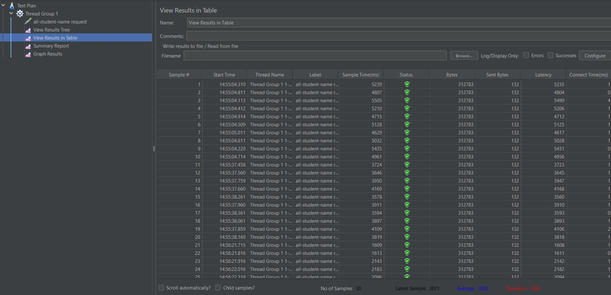
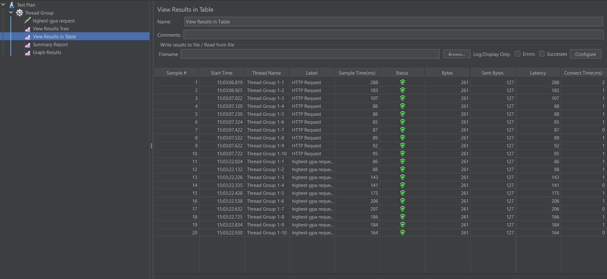
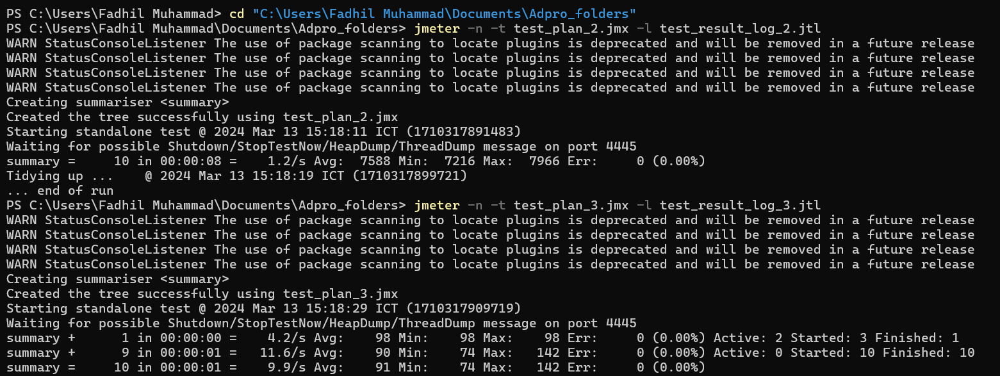
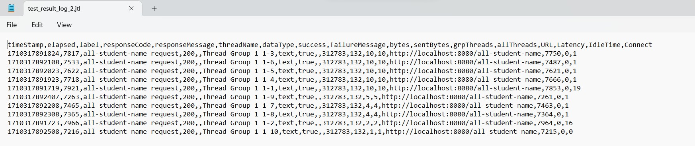
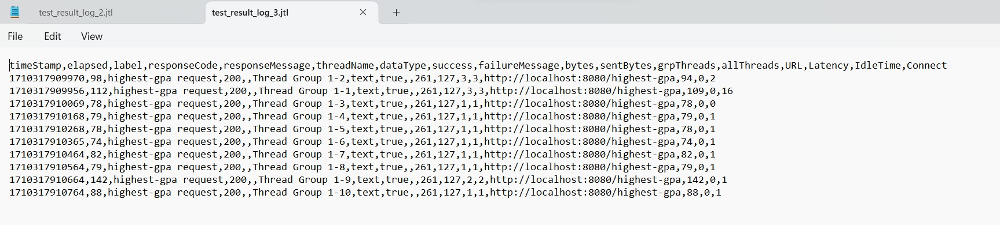
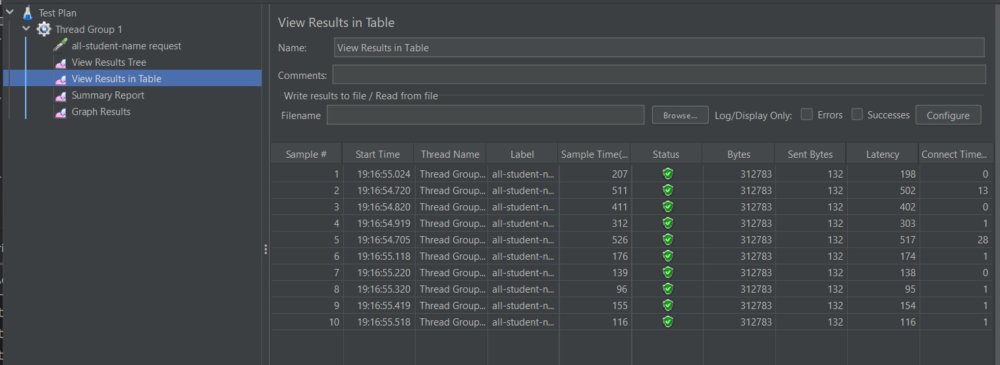

```
Fadhil Muhammad
2206083464
```

<details>
<summary style="font-size:20px">Refleksi Modul 5 </summary>

## What is the difference between the approach of performance testing with JMeter and profiling with IntelliJ Profiler in the context of optimizing application performance?

Pendekatan pengujian kinerja dengan JMeter dan profiling dengan IntelliJ Profiler memiliki fokus yang berbeda. JMeter digunakan untuk mengukur kinerja aplikasi di tingkat keseluruhan, sedangkan Profiler IntelliJ memungkinkan analisis mendalam pada tingkat kode. JMeter mengevaluasi respons aplikasi secara menyeluruh, sementara Profiler IntelliJ membantu mengidentifikasi dan memahami titik lemah dalam kode aplikasi.

## How does the profiling process help you in identifying and understanding the weak points in your application?

Proses profiling membantu dengan mengumpulkan data eksekusi aplikasi. Proses ini membantu saya dalam melakukan identifikasi titik lemah dan hotspots dalam kode. Hal ini memberikan gambaran lebih mendalam tentang waktu eksekusi, penggunaan memori, dan panggilan fungsi/method, membantu mengidentifikasi area yang memerlukan perbaikan untuk meningkatkan kinerja.

## Do you think IntelliJ Profiler is effective in assisting you to analyze and identify bottlenecks in your application code?

IntelliJ Profiler terbukti efektif dalam membantu analisis dan identifikasi bottlenecks dalam kode aplikasi. Dengan visualisasi yang bagus dan laporan yang rinci tentu mempermudah saya untuk mengidentifikasi area yang perlu dioptimalkan untuk meningkatkan kinerja aplikasi.

## What are the main challenges you face when conducting performance testing and profiling, and how do you overcome these challenges?

Salah satu kendala yang saya hadapi dalam melakukan pengujian dan profiling adalah memastikan bahwa refaktor yang dilakukan dalam upaya optimalisasi tidak mempengaruhi fungsi keseluruhan dari aplikasi dan memberikan hasil yang diinginkan. Penting untuk memastikan bahwa hasil yang dihasilkan sebelum refaktor sama persis dengan hasil yang diperoleh setelah refaktor dilakukan. Proses pengujian pada kode yang belum di-refaktor membutuhkan waktu yang cukup lama, yang dapat menghambat proses saya secara keseluruhan. Selain itu, ukuran data yang besar juga menambah waktu yang dibutuhkan untuk memeriksa bahwa outputnya tidak berubah setelah dilakukan refaktor.

## What are the main benefits you gain from using IntelliJ Profiler for profiling your application code?

Penggunaan IntelliJ Profiler memberikan manfaat berupa visualisasi yang jelas, pemahaman mendalam tentang kinerja kode, dan identifikasi titik-titik lemah yang membantu saya untuk membuat perbaikan yang tepat guna meningkatkan efisiensi aplikasi.

## How do you handle situations where the results from profiling with IntelliJ Profiler are not entirely consistent with findings from performance testing using JMeter?

Dalam konteks ini, merupakan hal yang penting untuk menginvestigasi penyebab perbedaan hasil yang terjadi. Kemungkinan ada faktor lingkungan atau variasi dalam skenario pengujian yang berkontribusi pada perbedaan tersebut. Dengan memeriksa secara cermat dan memastikan konsistensi pengaturan serta memahami konteks individu dari masing-masing instrumen yang digunakan, kita dapat lebih memahami perbedaan tersebut dan melakukan penyesuaian analisis yang sesuai.

## What strategies do you implement in optimizing application code after analyzing results from performance testing and profiling? How do you ensure the changes you make do not affect the application's functionality?

Setelah mengevaluasi hasil dari pengujian kinerja dan profiling, langkah strategis optimalisasi mencakup pengidentifikasian dan peningkatan pada area yang kurang efisien, penggunaan alat bantu seperti IntelliJ Profiler untuk analisis lebih lanjut, serta implementasi perubahan secara bertahap. Melakukan uji regresi dan pemantauan kinerja secara terus-menerus akan membantu memastikan bahwa perubahan yang dilakukan tidak mengganggu fungsi keseluruhan dari aplikasi tersebut. Saya mencoba untuk mencari cara bagaimana agar program dapat dijalankan dengan lebih efisien tanpa mengubah fungsionalitas aplikasinya.

# JMeter

## Before Optimization

Berikut adalah screenshot gambar hasil run JMeter untuk endpoint all_student_name dengan highest_gpa sebelum optimisasi




Perhatikan Sample Time sekarang.

## CMD Execution



## CMD Exec. Result






## After Optimization




Dapat terlihat pada hasil tangkapan layar di atas, Sample Time yang diperlukan untuk menjalankan task yang sama menjadi jauh lebih sedikit daripada sebelum dioptimisasi. Profiling dapat membantu kita sebagai programmer dalam mengoptimisasikan program aplikasi kita agar dapat berjalan dengan lebih efisien lagi. 
</details>